# AI Recruiting Agent (ATS)

ATS-система с двуязычной (RU/EN) обработкой резюме, гибридным семантико-лексическим
поиском и LLM-объяснениями для каждого кандидата. Принимает резюме по почте, парсит
без участия LLM, индексирует в Postgres+pgvector и подбирает кандидатов под
вакансию четырьмя стратегиями, включая Reciprocal Rank Fusion.

## Содержание

1. [Архитектура](#архитектура)
2. [Технологический стек](#технологический-стек)
3. [Этапы обработки](#этапы-обработки)
4. [Стратегии матчинга](#стратегии-матчинга)
5. [Результаты оценки](#результаты-оценки-на-resumecsv-24-категории)
6. [Развёртывание](#развёртывание)
7. [API](#api)
8. [CLI и эксплуатация](#cli-и-эксплуатация)
9. [Структура репозитория](#структура-репозитория)
10. [Примеры работы](#примеры-работы)

---

## Архитектура

```
┌─────────┐     ┌──────────────┐     ┌──────────────┐     ┌──────────────┐
│  Gmail  │ ──► │   Парсер     │ ──► │  Postgres +  │ ──► │   Matching   │
│  IMAP   │     │  (no-LLM)    │     │   pgvector   │     │   Strategy   │
└─────────┘     └──────────────┘     └──────────────┘     └──────┬───────┘
                                                                 │
                                          ┌──────────────────────┴─────┐
                                          ▼                            ▼
                                    ┌───────────┐               ┌─────────────┐
                                    │  FastAPI  │ ◄──────────►  │  Streamlit  │
                                    └───────────┘               └─────────────┘
```

**Принципы:**

* **Strategy Pattern для матчинга** — четыре независимых матчера за общим интерфейсом
  `MatchingStrategy`, выбираются через query-параметр API. Один и тот же код работает в
  CLI, API и UI.
* **Парсинг без LLM** — детерминированный пайплайн (pdfplumber/python-docx → сегментация
  по заголовкам → би­лингвальный NER → KeyBERT/regex для скиллов и дат). LLM используется
  только на стадии rerank.
* **Postgres как единый источник правды** — реляционные данные (вакансии, кандидаты),
  pgvector для cosine-поиска и JSONB для распарсенных полей. Миграции через Alembic.
* **Двуязычность из коробки** — `BAAI/bge-m3` нативно понимает RU и EN; spaCy
  `ru_core_news_md` + `en_core_web_md` склеиваются по перекрытию спанов; LLM-объяснения
  отдаются на языке вакансии.

---

## Технологический стек

| Слой | Технология | Зачем |
|---|---|---|
| База данных | PostgreSQL 17 + pgvector | Реляционные данные + векторный поиск в одной системе |
| Миграции | Alembic | Версионирование схемы |
| Embeddings | `BAAI/bge-m3` (1024-dim, sentence-transformers) | RU/EN, длинный контекст до 8192 токенов |
| Классический NLP | scikit-learn (TF-IDF + LogisticRegression) | Лексический сигнал, дополняет dense-эмбеддинги |
| LLM | Qwen (`qwen3-plus`, DashScope) | Сильная поддержка RU/EN, OpenAI-совместимый API |
| NER | spaCy (ru/en), KeyBERT, RapidFuzz | Парсинг полей резюме без LLM |
| Извлечение текста | pdfplumber, python-docx | PDF/DOCX → строки с типографикой |
| Бэкенд | FastAPI + asyncpg + SQLAlchemy 2.0 | Полностью асинхронный, OpenAPI из коробки |
| Фронтенд | Streamlit | Мульти-страничное приложение, минимальный фронт-код |
| Контейнеризация | Docker Compose | Postgres + migrate + api + ui единым стеком |
| Логирование | structlog (JSON в prod, console локально) | Контекст-aware логи, request-id для трассировки |

---

## Этапы обработки

### Stage 1 — Ингестия писем

`src/ats/ingestion/mail_client.py` — IMAP-клиент через `imap_tools`. Подключается к
Gmail, забирает все UNSEEN-сообщения, сохраняет PDF/DOCX-вложения в `data/raw/` с
именами `{uid}_{sanitized_name}.{ext}`. Sanitizer регулярки сохраняет кириллицу.
Дубликаты отсеиваются по SHA-256 (`data/raw/seen_hashes.json`). После успешного
сохранения письма помечаются прочитанными. Ошибки внутри одного письма не валят весь
батч — фиксируются в логах и пропускаются.

### Stage 1.5 — Postgres + pgvector

Две таблицы:

* `vacancies(id, title, experience, description, source_filename, embedding vector(1024), created_at)`
* `candidates(id, name, email, source_file, raw_text, embedding vector(1024), parsed_json jsonb, created_at)`

Естественные ключи дедупликации: `vacancies.source_filename` и
`candidates.source_file` — оба `UNIQUE`. Эмбеддинги nullable, заполняются
post-hoc при импорте/парсинге. `parsed_json` хранит весь `ParsedResume` (минус
`raw_text` и `embedding`, у которых свои колонки), чтобы UI не перепарсивал резюме.

### Stage 2 — Парсинг резюме без LLM

`src/ats/ingestion/parser/` — пайплайн `parse_resume(path) → ParsedResume`:

1. **Извлечение** (`extract.py`) — pdfplumber (с детектором двухколоночной вёрстки через
   гистограмму X-координат слов) + python-docx → `list[Line]` с типографическими
   метаданными (font size, bold, allcaps).
2. **Сегментация** (`segment.py`) — двуязычный конечный автомат. Заголовок секции
   определяется по типографии (font ≥ body+1 или bold или ALLCAPS) **И** нечёткому
   совпадению (RapidFuzz ≥ 85) со словарём `HEADER_DICT`. Возвращает
   `dict[Section, list[Line]]`.
3. **NER** (`ner.py`) — гибрид: `ru_core_news_md` + `en_core_web_md` склеиваются по
   перекрытию спанов, плюс `PhraseMatcher` по газеттирам
   `data/gazetteers/{orgs,unis}.txt` (~120 организаций, ~70 университетов), плюс
   кастомный `Matcher` для пар TitleCase / ALLCAPS токенов (ловит англоязычные
   названия, которые проскакивают мимо русской модели в смешанном тексте).
4. **Скиллы** — двухпутевая логика:
   * Если в секции `SKILLS` обнаружено ≥3 элементов, используется детерминированный
     парсер `skills_section.py` (бакеты `Category: item1, item2`, буллеты, plain
     comma-list). Шум (даты, телефоны, URL) фильтруется.
   * Иначе fallback на `keywords.py` — KeyBERT поверх bge-m3 с n-grams 1..3,
     MMR-diversity 0.5, объединённый стоп-лист RU+EN.
5. **Даты** (`ner.py:extract_date_ranges`) — три регэкса: классический `YYYY—YYYY`,
   `MM/YYYY — MM/YYYY`/`Месяц YYYY — Месяц YYYY` (двуязычные месяцы EN+RU), и
   одиночные даты (год выпуска). Возвращает `list[tuple[start, end]]` со
   start=None для одиночных дат.
6. **Опыт и образование** — построчный билдер с date-anchored блоками: каждое
   найденное range открывает новую запись, организация подбирается из NER-спанов,
   role — из первой "смысловой" строки блока.
7. **Эмбеддинг** (`embed.py`) — bge-m3 синглтон, разделяемый с KeyBERT (модель
   грузится один раз).

`HF_HUB_OFFLINE=1` на проде — без флага sentence-transformers делает HEAD-чек на HF
при каждом cold start (~6 минут).

### Stage 3 — Матчинг (Strategy Pattern)

См. раздел [Стратегии матчинга](#стратегии-матчинга).

### Stage 4 — API + UI

* **FastAPI** (`src/ats/api/`) — `/health`, `/vacancies`, `/candidates`,
  `/recommendations` (главный endpoint). CRUD для вакансий и кандидатов
  (POST/PUT/DELETE). Middleware привязывает 8-символьный `request_id` к каждой строке
  structlog для всего жизненного цикла запроса. Lifespan-prewarm прогревает
  bge-m3 и фит TF-IDF при старте — первый пользовательский запрос не платит
  cold-start цену в ~20 с.
* **Streamlit** (`src/ats/ui/`) — три страницы:
  * `app.py` — главная: подбор кандидатов под выбранную вакансию или ad-hoc текст.
  * `pages/2_📋_All_Vacancies.py` — обзор всех вакансий с кнопкой "🔍 Match", которая
    переключает на главную страницу с предвыбранной вакансией.
  * `pages/3_⚙️_Manage.py` — CRUD-интерфейс: создание/редактирование/удаление вакансий,
    загрузка резюме (PDF/DOCX, multipart upload, парсинг inline).

### Stage 5 — Production hardening

* **Изоляция оценочных данных** — все 2,484 строки Resume.csv лежат в БД как
  `candidates.source_file LIKE 'resume_csv_%'`. Production-матчеры исключают этот
  префикс через `RESUME_CSV_PREFIX` константу в `ats.matching.base`. Eval-скрипты,
  наоборот, скоупятся именно на этот префикс. UI и API никогда не возвращают
  оценочных кандидатов.
* **Полный CRUD** — POST/PUT/DELETE для вакансий с автогенерацией `source_filename`,
  re-embedding при изменении title/description. POST /candidates принимает
  multipart-загрузку (≤15 MB, .pdf/.docx), парсит inline, складывает файл в `data/cvs/`.
* **RRF Fusion** — новая стратегия `rrf` фьюжит semantic + tfidf по рангу (см. ниже).

---

## Стратегии матчинга

Все четыре стратегии реализуют один интерфейс:

```python
class MatchingStrategy(ABC):
    name: str
    async def match_by_vacancy(session, job_id, top_k=None) -> list[CandidateMatch]: ...
    async def match_by_text(session, vacancy_text, top_k=None, vacancy_title=None) -> ...
```

Возвращают `CandidateMatch(candidate_id, name, email, source_file, score∈[0,1],
strategy, explanation, parsed_json)`. Score нормализован для UI; `strategy` — имя
матчера; `explanation` заполняется только LLM-стратегией.

### 1. Semantic — pgvector cosine

`SemanticMatcher` (`ats.matching.semantic`). Вакансия эмбеддится bge-m3 как
`f"{title}\n\n{description}"`, делается `Candidate.embedding.cosine_distance(query_vec)`
через pgvector `<=>`. Score = `1 - cosine_distance`, клипается в [0, 1]. На
нормализованных векторах реальные значения сидят в [0.35, 0.65]; ≥0.55 — сильное
совпадение.

### 2. TF-IDF + Logistic Regression

`TfidfMatcher` (`ats.matching.tfidf`). Два сигнала:

* **Основной**: TF-IDF cosine на словаре, фитнутом по всем кандидатам + всем
  вакансиям + Resume.csv (двадцати тысячное окно фичей, n-grams 1..2,
  `sublinear_tf=True`, объединённые RU+EN стоп-слова).
* **Бустер**: LogisticRegression(`C=1.0`), натренированный на Resume.csv
  (2,484 резюме → 24 категории). При совпадении предсказанных категорий вакансии и
  кандидата к cosine добавляется `+CATEGORY_BOOST = 0.10`. Буст пропускается, если
  в вакансии или в кандидате обнаружена кириллица (классификатор только англоязычный).

Стейт (`_State` dataclass) кэшируется на уровне модуля; инвалидация при изменении
`COUNT(candidates)`.

### 3. LLM rerank — Qwen DashScope

`LlmMatcher` (`ats.matching.llm`). Двухстадийный матчер: ретривер (по умолчанию
`SemanticMatcher`, заменяется параметром `retriever=...`) выдаёт shortlist=15
кандидатов, потом Qwen rescore-ит каждого. Промпт даёт якорную рубрику 0.0/0.2/.../1.0
и явный гард против positivity bias ("не давай ≥0.7 если не выполнены 3+ ключевых
требования"). Ответ — strict JSON `{score, explanation}`, парсится тремя слоями
(response_format → pydantic → regex fallback). При фейле LLM остаётся score
ретривера, explanation = None — пользователь не блокируется 500-ой.

Технические настройки:

* `extra_body={"enable_thinking": False}` — Qwen reasoning-модель, без флага один
  вызов ~12 с (с reasoning-токенами), с флагом ~3.3 с.
* `asyncio.Semaphore(5)` — ограничение конкуррентности (DashScope rate-limit).
* SDK `AsyncOpenAI(timeout=30, max_retries=3)` — exp-backoff на 429/5xx из коробки.
* Двуязычные промпты: `system_ru` / `system_en` выбираются по присутствию кириллицы в
  вакансии.

### 4. Reciprocal Rank Fusion (RRF) — Stage 5

`RrfMatcher` (`ats.matching.rrf`). Для каждого кандидата `c`, появившегося хотя бы в
одном из входных рейтингов `R`:

```
score(c) = Σ_R   1 / (k + rank_R(c))
```

`k = 60` — константа сглаживания (Cormack et al. 2009, доминирует на TREC). RRF —
**ранговая** фьюжн: игнорирует абсолютные значения score, смотрит только на позицию.
Это правильное свойство здесь: семантические score сидят в [0.35, 0.65], TF-IDF в
[0.10, 0.45] — смешивать их по значению было бы apples-to-oranges, по рангу —
корректно при любых распределениях.

Дефолтная конфигурация: `[SemanticMatcher(), TfidfMatcher()]`, `over_fetch = 3`
(каждый ретривер тянет `top_k × 3` кандидатов, чтобы фьюжн имел из чего выбирать).
Запуск сериальный (один AsyncSession не safe для конкуррентных await — sub-100ms
запросы делают параллелизацию ненужной).

API позволяет переопределить retriever для LLM-стратегии:
`/recommendations?strategy=llm&retriever=rrf` — пайплайн становится
**RRF → LLM rerank**, объединяя ранговый бленд с языковым reasoning.

---

## Результаты оценки на Resume.csv (24 категории)

Бенчмарк: 24 эталонные вакансии (по одной на каждую категорию Resume.csv) против
2,484 размеченных резюме. Метрики macro-усреднены по категориям. Реальные кандидаты
(Abdi, Nurlan) исключены из бенчмарка — оценка скоуплена строго на
`source_file LIKE 'resume_csv_%'`.

| Метрика | Semantic (3.1) | TF-IDF (3.2) | **RRF (5.E)** | RRF → LLM (5.E + 3.3) |
|---|---:|---:|---:|---:|
| P@1     | **0.7917** | 0.7083 | **0.7917**  | 0.7500 |
| P@3     | 0.7222 | 0.7361 | **0.7500**  | 0.7361 |
| P@5     | 0.7083 | 0.7417 | **0.7583**  | 0.7417 |
| P@10    | 0.6833 | 0.7500 | **0.7542**  | 0.7375 |
| MRR     | 0.8462 | 0.7854 | **0.8500**  | 0.8167 |
| NDCG@5  | 0.7216 | 0.7359 | **0.7594**  | 0.7386 |
| Random P@1 baseline | | | 0.0417 | |

**Выводы:**

* **RRF — самый сильный матчер по большинству метрик.** Выигрывает или делит первое
  место по P@1, P@3, P@5, MRR, NDCG@5. Это ожидаемый результат: семантические
  эмбеддинги ловят парафразы и синонимы, TF-IDF — редкие термы и точные технологии,
  а RRF их кооперативно бленднет.
* **Semantic и RRF делят P@1** — для топ-1 рекомендации обе стратегии одинаково
  сильны, поэтому если приоритет — единственный лучший кандидат, можно остаться на
  Semantic (быстрее, нет LR-обучения).
* **TF-IDF доминирует на глубине без RRF** — лучший P@10 среди одиночных матчеров,
  потому что лексический сигнал не "размазывается" так быстро, как dense-cosine.
* **LLM rerank на бенчмарке проигрывает RRF.** Это не баг — это особенность
  бенчмарка. Resume.csv размечен только по категориям (`HEALTHCARE`,
  `FITNESS`, …), а LLM rescore-ит по реальному соответствию роли — может поднять
  фитнес-релевантного кандидата с категорией HEALTHCARE над буквально-помеченным
  FITNESS-кандидатом. Это **failure mode разметки**, не модели. Главная ценность
  LLM — **объяснения**, которые ни один из метрик-based матчеров не даёт.
* **Random P@1 baseline = 0.0417** (1/24); все матчеры дают порядок +17—19×
  улучшения над случайным выбором.

### Воспроизведение

Все четыре скрипта идемпотентны и поддерживают `--skip-import`:

```bash
HF_HUB_OFFLINE=1 PYTHONPATH=src python -m ats.utils.eval_semantic  # ~30 с
PYTHONPATH=src python -m ats.utils.eval_tfidf                       # ~25 с
HF_HUB_OFFLINE=1 PYTHONPATH=src python -m ats.utils.eval_rrf        # ~50 с
HF_HUB_OFFLINE=1 PYTHONPATH=src python -m ats.utils.eval_llm --retriever rrf  # ~5 мин, ~$0.40
```

Метрики печатаются в stdout. Логи в файлы не пишутся — пайплайн оценки полностью
эфемерный.

---

## Развёртывание

### Полностью через Docker (рекомендованный путь)

```bash
# 1. Подготовить .env (Postgres креды, DASHSCOPE_API_KEY, IMAP_* для Gmail)
cp .env.example .env  # отредактировать

# 2. Поднять стек
cd docker
docker compose build           # ~5 минут первый раз (torch, sklearn, spacy)
docker compose up -d           # postgres + migrate + api + ui

# 3. Дождаться готовности (~30 с при прогретом hf_cache, иначе модель тянется ~10 мин)
docker compose ps              # все 4 сервиса healthy

# 4. Bootstrap данных — одноразово, идемпотентно
docker compose exec api python -m ats.utils.import_vacancies                 # 8 prod-вакансий
docker compose exec -e HF_HUB_OFFLINE=1 api python -m ats.utils.embed_vacancies
docker compose exec -e HF_HUB_OFFLINE=1 api python -m ats.ingestion.parser data/cvs/

# 5. Открыть
xdg-open http://localhost:8501       # Streamlit UI
xdg-open http://localhost:8000/docs  # FastAPI OpenAPI
```

bge-m3 (~3.1 GB) живёт в named volume `ats_hf_cache`, скачивается при первом старте
контейнера. Чтобы пред-загрузить с хоста и избежать долгого первого старта:

```bash
docker volume create ats_hf_cache
docker run --rm -v ats_hf_cache:/cache -v ~/.cache/huggingface:/host:ro \
  alpine sh -c "cp -r /host/. /cache/"
```

### Локальная разработка (без Docker для приложения)

```bash
pip install -e ".[dev]"
.venv/bin/python -m spacy download ru_core_news_md
.venv/bin/python -m spacy download en_core_web_md
cd docker && docker compose up -d postgres   # только БД
alembic upgrade head

# Импорт вакансий и парсинг резюме
HF_HUB_OFFLINE=1 PYTHONPATH=src python -m ats.utils.import_vacancies
HF_HUB_OFFLINE=1 PYTHONPATH=src python -m ats.utils.embed_vacancies
HF_HUB_OFFLINE=1 PYTHONPATH=src python -m ats.ingestion.parser data/cvs/

# Запуск
HF_HUB_OFFLINE=1 PYTHONPATH=src python -m ats.api          # API на :8000
PYTHONPATH=src streamlit run src/ats/ui/app.py             # UI на :8501
```

---

## API

| Метод | Путь | Назначение |
|---|---|---|
| `GET` | `/health` | Liveness probe |
| `GET` | `/vacancies` | Список вакансий |
| `GET` | `/vacancies/{id}` | Полная вакансия |
| `POST` | `/vacancies` | Создать (с авто-эмбеддингом) |
| `PUT` | `/vacancies/{id}` | Обновить (re-embed если изменился текст) |
| `DELETE` | `/vacancies/{id}` | Удалить |
| `GET` | `/candidates` | Список (`?include_eval=false` по умолчанию исключает Resume.csv) |
| `GET` | `/candidates/{id}` | Полный кандидат с `parsed_json` + 3000-char excerpt |
| `POST` | `/candidates` | Multipart-загрузка PDF/DOCX, парсинг inline |
| `DELETE` | `/candidates/{id}` | `?keep_file=true` чтобы оставить файл на диске |
| `GET` | `/recommendations` | **Главный endpoint** — см. ниже |
| `GET` | `/docs` | OpenAPI Swagger UI |

### `GET /recommendations`

Параметры:

| Параметр | Тип | Описание |
|---|---|---|
| `job_id` | int | ID вакансии (взаимоисключим с `text`) |
| `text` | str | Ad-hoc текст вакансии |
| `title` | str? | Заголовок для ad-hoc текста |
| `strategy` | `semantic`/`tfidf`/`rrf`/`llm` | По умолчанию `semantic` |
| `top_k` | int (1–50) | По умолчанию 5 |
| `retriever` | `semantic`/`tfidf`/`rrf` | Переопределяет ретривер для `strategy=llm` |

Статус-коды: `400` (оба/ни одного из `job_id`/`text`, или `retriever` без
`strategy=llm`), `404` (нет такой вакансии), `412` (у вакансии или кандидатов
отсутствует embedding — нужно прогнать `embed_vacancies`/парсер), `200` ОК.

---

## CLI и эксплуатация

### Матчинг из CLI

```bash
# Все вакансии, топ-5
HF_HUB_OFFLINE=1 PYTHONPATH=src python -m ats.matching

# Одна вакансия
HF_HUB_OFFLINE=1 PYTHONPATH=src python -m ats.matching --job 7 --strategy llm --top-k 3

# Ad-hoc текст
HF_HUB_OFFLINE=1 PYTHONPATH=src python -m ats.matching \
  --text "Need a Python ML engineer with FastAPI" --strategy rrf --top-k 5
```

### Импорт и парсинг

```bash
# Импорт вакансий из JSON (идемпотентно по source_filename)
PYTHONPATH=src python -m ats.utils.import_vacancies                  # data/vacancies/
PYTHONPATH=src python -m ats.utils.import_vacancies --force file.json  # перезапись

# Эмбеддинг вакансий без embedding=NULL
HF_HUB_OFFLINE=1 PYTHONPATH=src python -m ats.utils.embed_vacancies

# Парсинг резюме (data/cvs/*.pdf, *.docx)
HF_HUB_OFFLINE=1 PYTHONPATH=src python -m ats.ingestion.parser data/cvs/
HF_HUB_OFFLINE=1 PYTHONPATH=src python -m ats.ingestion.parser --dry-run cv.pdf
HF_HUB_OFFLINE=1 PYTHONPATH=src python -m ats.ingestion.parser --force cv.pdf
```

### Ингестия из Gmail

```bash
PYTHONPATH=src python -m ats.ingestion.mail_client  # забрать UNSEEN, сохранить в data/raw/
```

---

## Структура репозитория

```
src/ats/
  core/         # config, logger, prompts loader
  db/           # SQLAlchemy модели + async engine/session
  ingestion/
    mail_client.py        # Gmail IMAP
    parser/               # extract → segment → ner → skills → embed → pipeline
  matching/
    base.py     # MatchingStrategy ABC + CandidateMatch + RESUME_CSV_PREFIX
    semantic.py # 3.1
    tfidf.py    # 3.2
    llm.py      # 3.3
    rrf.py      # 5.E
    cli.py      # python -m ats.matching
  api/
    app.py              # FastAPI factory + lifespan + middleware
    routers/            # health, vacancies, candidates, recommendations
  ui/
    app.py              # главная страница
    api_client.py       # sync requests-обёртка
    pages/              # 2_📋_All_Vacancies, 3_⚙️_Manage
  utils/
    import_vacancies.py
    embed_vacancies.py
    eval_common.py      # shared metrics + scoped retrievers
    eval_semantic.py    # 3.1 бенчмарк
    eval_tfidf.py       # 3.2 бенчмарк
    eval_rrf.py         # 5.E бенчмарк
    eval_llm.py         # 3.3 бенчмарк (--retriever {semantic,tfidf,rrf})

configs/
  config.yaml   # пути, модели, матчинг — все настройки в одном файле
  prompts.yaml  # двуязычные LLM-промпты

data/
  cvs/                # production CVs (git-tracked)
  raw/                # Gmail-target (git-ignored)
  vacancies/          # production вакансии (8 шт, git-tracked)
  eval/
    Resume.csv        # 2,484 размеченных резюме (git-ignored, 60 MB)
    vacancies/        # 24 эталонные вакансии (git-tracked)
  gazetteers/         # orgs.txt, unis.txt — справочники для NER

migrations/   # Alembic миграции
docker/       # Dockerfile + docker-compose.yaml + .dockerignore
tests/        # pytest unit-тесты
```

---

## Примеры работы

<!-- TODO: добавить скриншоты и примеры -->

### Пример 1. Матчинг через API

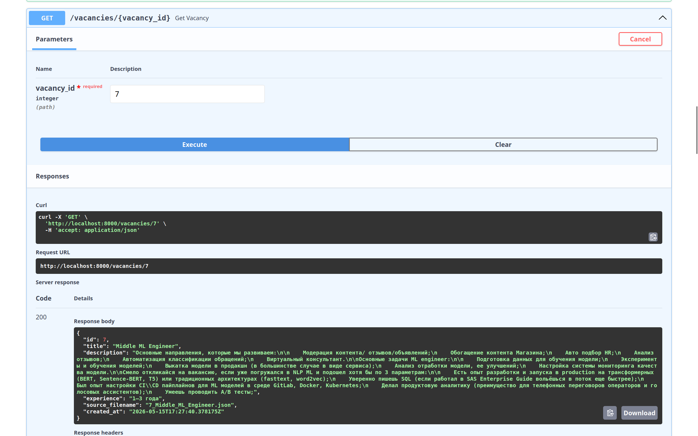

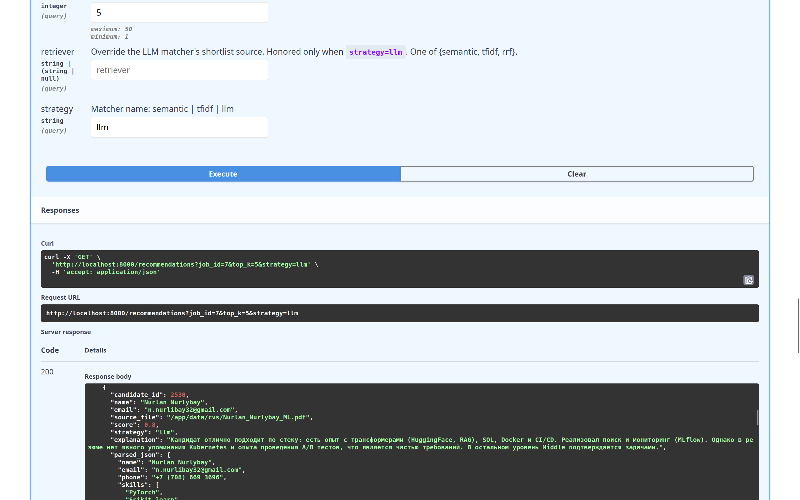

<!-- TODO: пример curl-запроса и ответа -->

### Пример 2. Streamlit UI

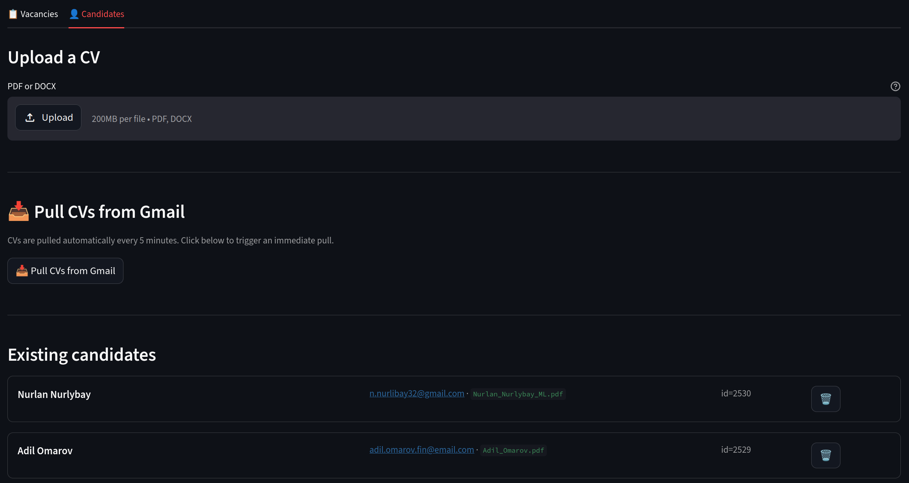
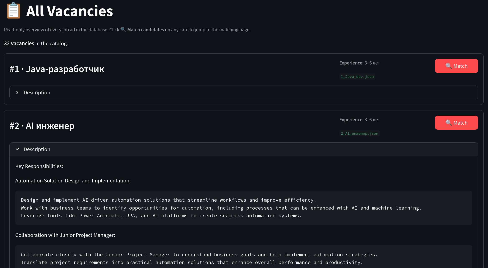
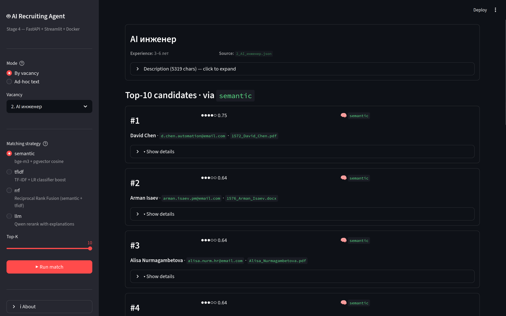

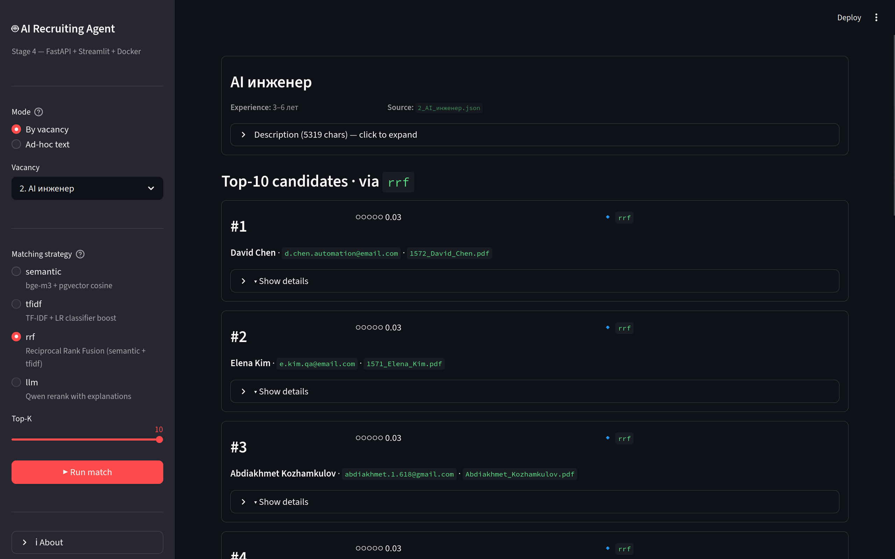
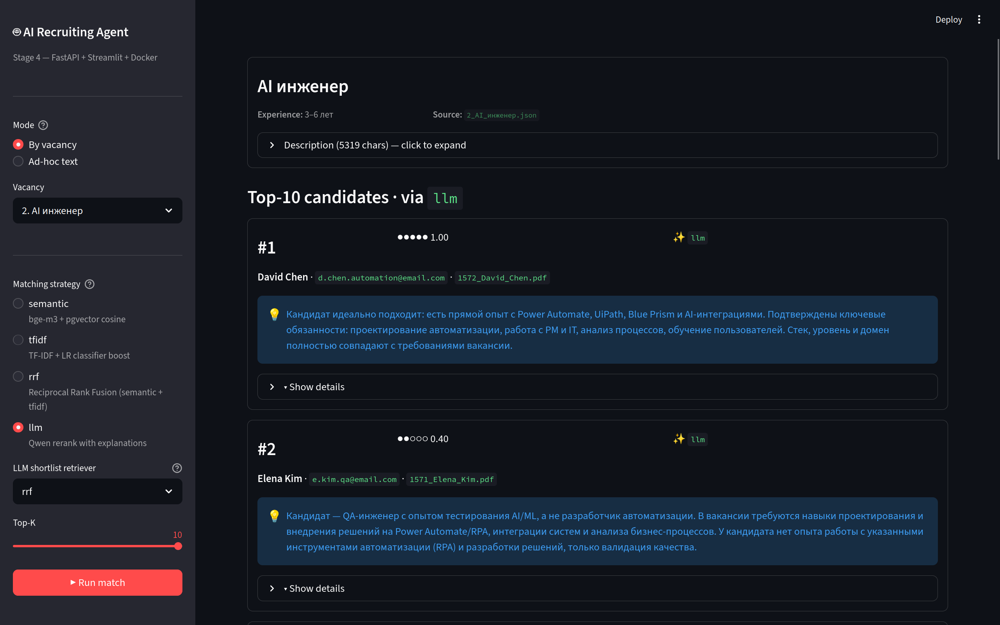
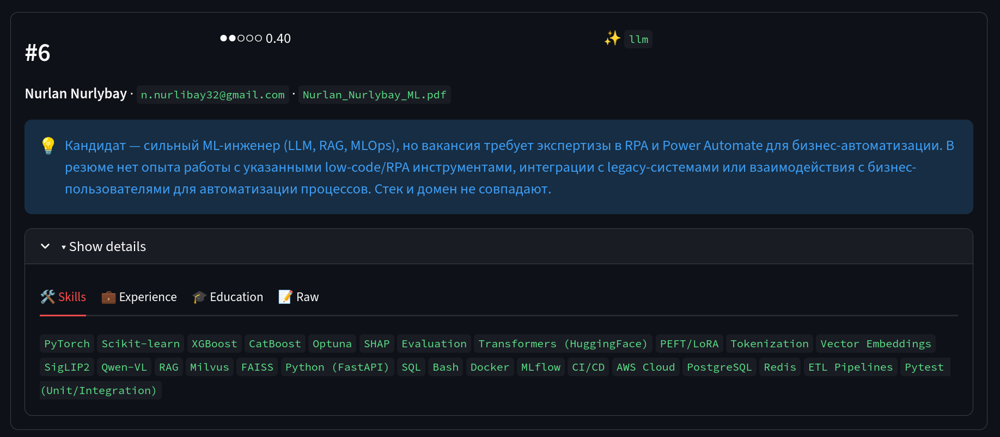
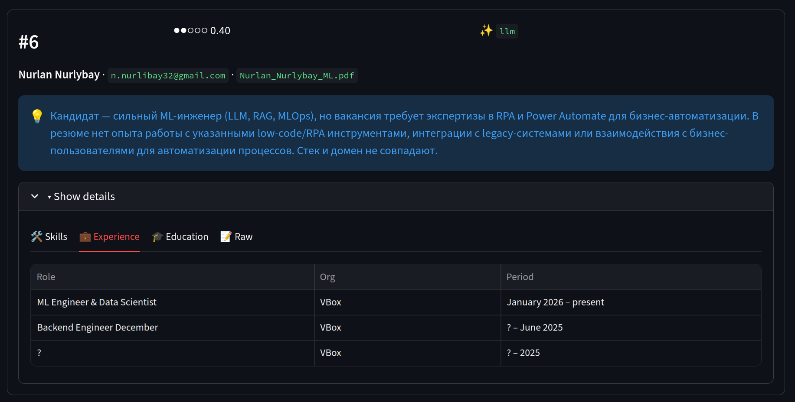
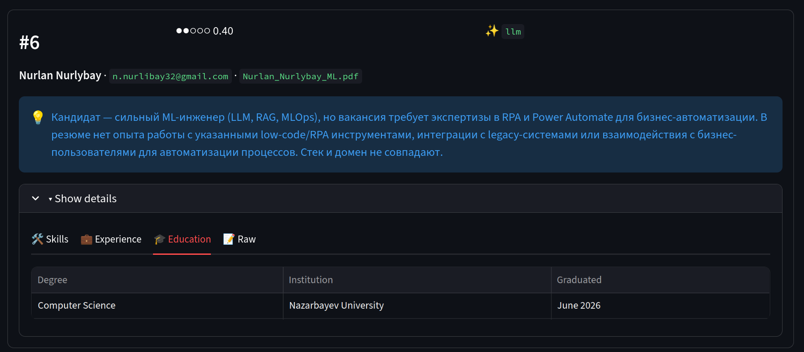
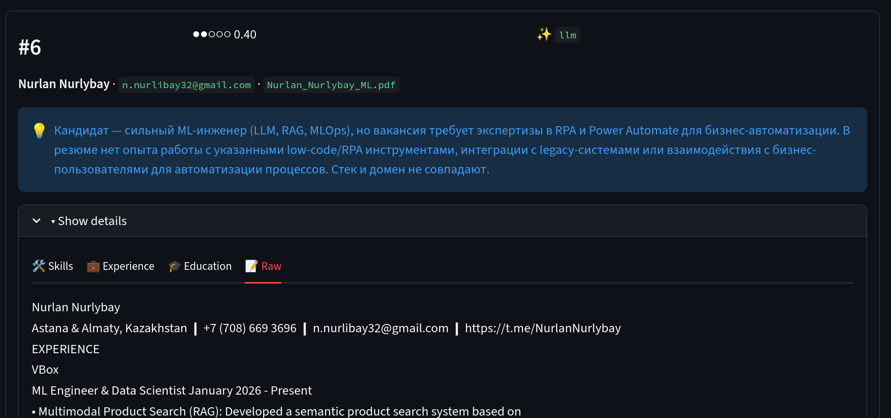

### Пример 3. CLI

```bash
nurlan@legion:~/projects/ats$ docker compose -f docker/docker-compose.yaml exec \
    -e HF_HUB_OFFLINE=1 api \
    python -m ats.matching --job 7 --strategy semantic --top-k 5
2026-05-18T09:19:39.985937Z [info     ] match_by_vacancy               [ats.matching.semantic] job_id=7 title='Middle ML Engineer' top_k=5
2026-05-18T09:19:39.989110Z [info     ] match_done                     [ats.matching.semantic] results=5 top_score=0.6483171405414175

Vacancy 7: Middle ML Engineer
  1. (0.648) Ербол Жумабаев <e.zhumabayev.ml@email.com>  1564_Ербол_Жумабаев.pdf
  2. (0.573) Elena Kim <e.kim.qa@email.com>  1571_Elena_Kim.pdf
  3. (0.565) Нурлан Нурлыбай <n.nurlibay32@gmail.com>  Нурлан_Нурлыбай_Бэкенд.docx
  4. (0.562) Nurlan Nurlybay <n.nurlibay32@gmail.com>  Nurlan_Nurlybay_ML.pdf
  5. (0.532) Контакты <a.smirnov.dev@email.com>  1567_Артем_Смирнов.pdf
nurlan@legion:~/projects/ats$ 
```

